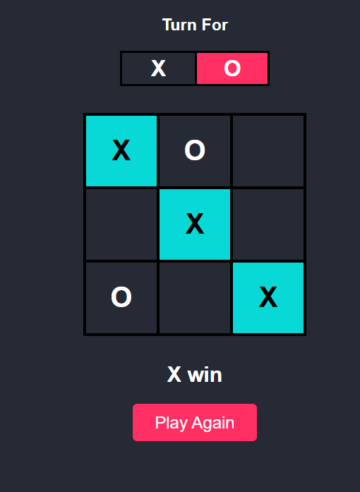

# Tic-Tac-Toe Web Application

This is a simple Tic-Tac-Toe game built using basic web technologies: **HTML**, **CSS**, and **JavaScript**. It allows two players to play against each other on the same device, taking turns to place X's and O's on a 3x3 grid.

## Features

- **Two-player mode**: Play Tic-Tac-Toe with a friend.
- **Interactive UI**: Click to place your mark on the board.
- **Win/Loss/Draw detection**: The game automatically detects when a player wins or the game ends in a draw.
- **Responsive design**: The layout is responsive, and the game adapts to different screen sizes.
- **Reset functionality**: Reset the game board to start a new game.

## Tech Stack

- **HTML5**: Structure of the game board and interface.
- **CSS3**: Styling the game and ensuring a responsive layout.
- **JavaScript**: Game logic for handling player turns, win conditions, and resetting the board.

## ScreenShot (UI) 

